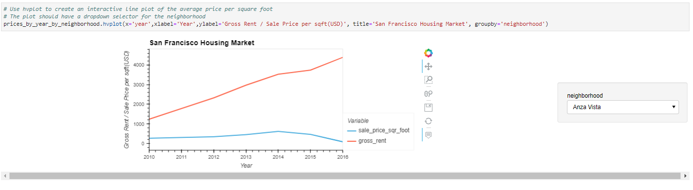

# module_6_challenge

The module 6 challenge for fintech course

The Jupyter Lab file follows along as an exercise to produce interactive plots using the hvplot and geoview functionality with pandas.  Complex visualizations are possible, including overlaying them on maps.

---

## Technologies

The sheet requires Pandas for analyzing data frames in jupyter labs.
It requires Jupyter Labs for a user interface.
It requires Path from pathlib to help read .csv files.
Requires hvplot (0.7.3) and geoviews(1.9.3)

---

## Installation Guide

Other than Python 3.7, the hvplot and geoviews packages are required, Jupyter Labs runs in a browser, including Chrome.  Launch the file by navigating to the directory of the file through a CLI and then running Jupyter labs, with "jupyter lab".

hvplot and geoviews can be installed form the CLI with the following:

conda install -c pyviz hvplot geoviews

---

## Usage

The worksheet runs through a scenario and teaches the user to create interactive hvplots:

---

## Contributors

Michael Canavan

---

## License

The content of the course is owned and managed by UC Berkeley Fintech Bootcamp.